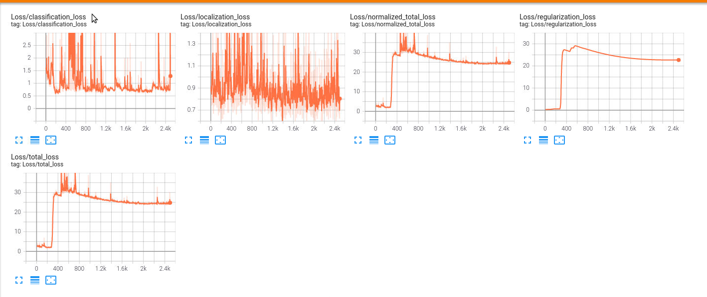
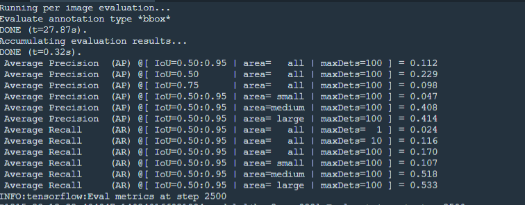
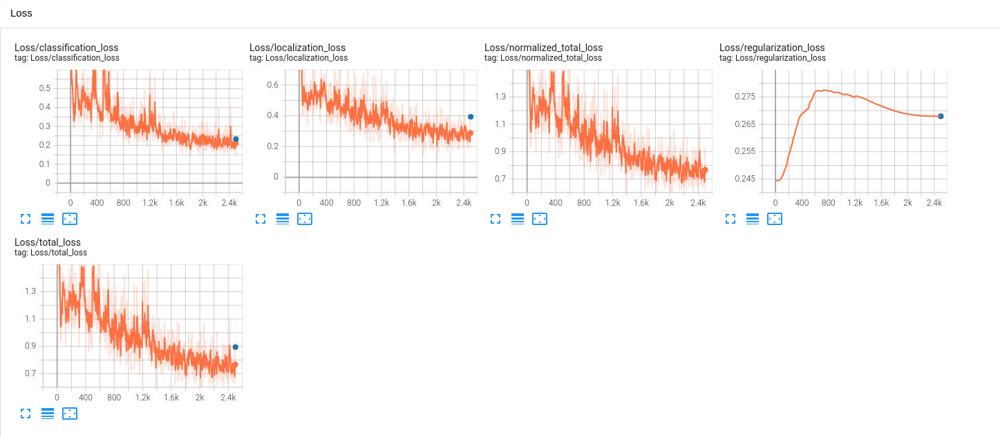
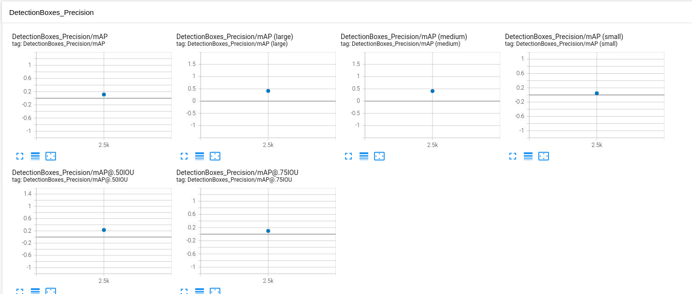
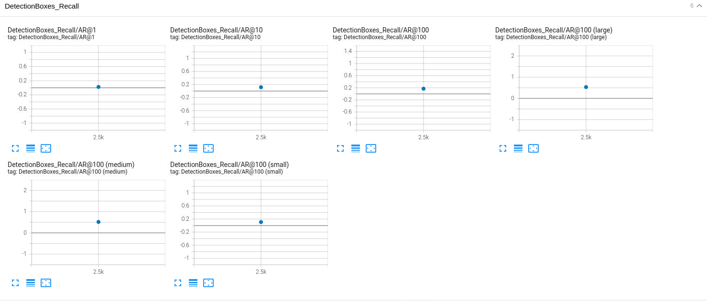

# Object Detection in an Urban Environment

## Data

For this project, we will be using data from the [Waymo Open dataset](https://waymo.com/open/).


## Structure

### Data

The data you will use for training, validation and testing is organized as follow:
```
/home/workspace/data/waymo
	- training_and_validation - contains 97 files to train and validate your models
    - train: contain the train data (empty to start)
    - val: contain the val data (empty to start)
    - test - contains 3 files to test your model and create inference videos
```
The `training_and_validation` folder contains file that have been downsampled: we have selected one every 10 frames from 10 fps videos. The `testing` folder contains frames from the 10 fps video without downsampling.


### Experiments
The experiments folder will be organized as follow:

```
experiments/
    - pretrained_model/
    - exporter_main_v2.py - to create an inference model
    - model_main_tf2.py - to launch training
    - reference/ - reference training with the unchanged config file
    - experiment0/ - create a new folder for each experiment you run
    - experiment1/ - create a new folder for each experiment you run
    - experiment2/ - create a new folder for each experiment you run
    - label_map.pbtxt
    ...
```

I have used Classroom Workspace for implementing the project.

### Classroom Workspace

In the classroom workspace, every library and package should already be installed in your environment.

## Instructions

### Exploratory Data Analysis

 The waymo dataset contains information about images and associated bounding boxes with each image. we have detected three types of objects vehicles, pedestrians and cyclists.

The function **display_images** will randomly display 10 images as shown below:

      

    


Further, I have randomly selected some samples to get an idea about class distribution.

It's observed that the dataset  is highly imbalanced.

The figure below shows that number of vehicle is much more than pedestrain and cyclist.


### Edit the config file

Object Detection API relies on config files. The config that we will use for this project is pipeline.config, which is the config for a SSD Resnet 50 640x640 model. You can learn more about the Single Shot Detector here.

First, let's download the pretrained model and move it to /home/workspace/experiments/pretrained_model/.

We need to edit the config files to change the location of the training and validation files, as well as the location of the label_map file, pretrained weights. We also need to adjust the batch size. To do so, run the following:
```
python edit_config.py --train_dir /home/workspace/data/train/ --eval_dir /home/workspace/data/val/ --batch_size 2 --checkpoint /home/workspace/experiments/pretrained_model/ssd_resnet50_v1_fpn_640x640_coco17_tpu-8/checkpoint/ckpt-0 --label_map /home/workspace/experiments/label_map.pbtxt
```
A new config file has been created, `pipeline_new.config`.

### Training

We will launch the very first experiment with the Tensorflow object detection API. Move the `pipeline_new.config` to the `/home/workspace/experiments/reference` folder. Now launch the training process:
* a training process:
```
python experiments/model_main_tf2.py --model_dir=experiments/reference/ --pipeline_config_path=experiments/reference/pipeline_new.config

```

Below are the results of the reference training experiment

  

We can see that the overall loss is fluctuating and at the end of 2500 steps it is around 24 which is really high.

Once the training is finished, launch the evaluation process:
* an evaluation process:

Below is the result for the evaluation process

  
```
python experiments/model_main_tf2.py --model_dir=experiments/reference/ --pipeline_config_path=experiments/reference/pipeline_new.config --checkpoint_dir=experiments/reference/
```

**Note**: Both processes will display some Tensorflow warnings, which can be ignored. We have to kill the evaluation script manually using
`CTRL+C`.

To monitor the training, you can launch a tensorboard instance by running `python -m tensorboard.main --logdir experiments/reference/`. 

Initially,  I implemented the reference experiment with default settings (i.e; with batch size of 2).


### Improve the performances

Most likely, this initial experiment did not yield optimal results. Hence, I have utilized different data augmentation method available in the TF object Detection API. The [`preprocessor.proto`](https://github.com/tensorflow/models/blob/master/research/object_detection/protos/preprocessor.proto) file contains the different data augmentation method available in the Tf Object Detection API. To help visualize these augmentations, the notebook can be implemented: `Explore augmentations.ipynb`. 


**Important:**  Delete the checkpoints files after each experiment. However keep the `tf.events` files located in the `train` and `eval` folder of the experiments for logging the results in tensorboard. Also keep the `saved_model` folder to create videos later.

### Expriment:
For improving the reference run, I have added **Augmentations** to introduce variability in the dataset so that it can handle other cases that are not reflected in the original dataset. In this case, the augmentations used in addition to the default are :

- random_adjust_brightness and random_adjust_contrast to increase the diversity in brightness and contrast across the given images

- random_adjust_hue, random_rgb_to_gray and random_adjust_saturation to mimic different light conditions (e.g. a blueish or yellowish tint caused by artificial lights)

- random_patch_gaussian to mimic blurs and flares caused by different weather conditions (e.g. rain on the camera lens)

- random_black_patches to mimic occlusions (i.e. caused by other objects)

- I kept the already implemented augmentations (horizontal flip and image crop)


The images given below demonstrates the augmentations:

      

### Further Improvements
I have used the momentum_optimizer with cosine_decay_learning_rate.

I have changed the learning rate base to 0.02, warmup_learning_rate to 0.0002.

Below are the images to demonstrate the training on the train dataset and its evaluation on test dataset.
  
 
  

From the images we can infer the loss is drastically decreased to around 0.89. Comparitively, it is far better than the reference run.Better performance is observed in the precision and recall plot. 

  

For implementing the improved run, type the below command in the command line
```
python experiments/model_main_tf2.py --model_dir=experiments/experiment_2/ --pipeline_config_path=experiments/experiment_2/pipeline1.config

```

For evaluation

```
python experiments/model_main_tf2.py --model_dir=experiments/experiment_2/ --pipeline_config_path=experiments/experiment_2/pipeline1.config --checkpoint_dir=experiments/experiment_2/
```

### Creating an animation
#### Export the trained model by implementing the below command


```
python experiments/exporter_main_v2.py --input_type image_tensor --pipeline_config_path experiments/experiment_2/pipeline1.config --trained_checkpoint_dir experiments/experiment_2/ --output_directory experiments/experiment_2/exported/
```

This will create a new folder `experiments/reference/exported/saved_model`. You can read more about the Tensorflow SavedModel format [here](https://www.tensorflow.org/guide/saved_model).

Finally, create a video of your model's inferences for any tf record file. To do so, run the following command:
```
python inference_video.py --labelmap_path label_map.pbtxt --model_path experiments/experiment_2/exported/saved_model --tf_record_path /data/waymo/testing/segment-12200383401366682847_2552_140_2572_140_with_camera_labels.tfrecord --config_path experiments/experiment_2/pipeline1.config --output_path animation.gif
```

The video can be found below:
  
